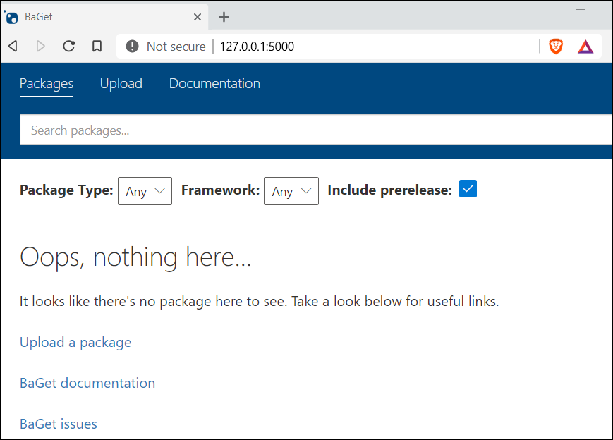
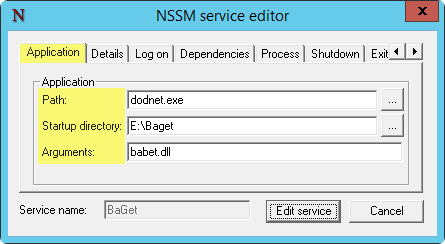
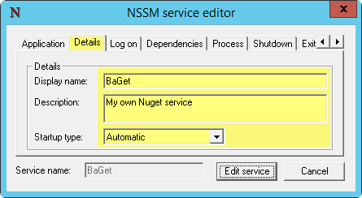

## Setting up local nuget service
In this tutorial we are going to set up and configure local a NuGET service\
for our development network.\
The service will be available to local network, with an option to expose it\
to the public network if needed.
## Components
### The host

To get everything up and running, I will use a standalone Windows 2012 R2 server\
with the following properties:

|Property          |Value
|:---              |:---
|OS                | Windows Server 2012R2
|Type              | Virtual
|vCPU              | 2 (**more is better**)
|vRAM              | 4 GB (**more is better**)
|Domain Joined     | optional

The server will have 2 virtual drives - drive [**C**] for the operating system,
and \
drive [**E**] to house the service binaries and user repositories.

### Software
For the purpose of this tutorial, I will use `baget` server.\
Here are the details:
|Propery           |Value
|:---              |:---
|Software          | BaGet
|Software URL      | https://github.com/loic-sharma/BaGet/
|Software installed| E:\Baget\

## Installation tips and issues
The software works right of the box, just unzip to a folder and run the start command.\
After starting up, the server listens on 127.0.0.1 port 5000, and there are no obvious\
ways to change that without re-compiling. The software author claims that IIS could be\
used as a proxy, but in reality Windows 2012R2 Server has unexplainable problem with it.\
Might be related to .NET vs .NET Core which BaGet requires.\
This effectively renders the software bound to localhost with no easy way to\
expose it to the rest of the LAN.

## Exposing to the external hosts
### Method 1
To expose the service to the LAN a built-in windows ***portproxy*** feature was used. This feature\
allows forwarding traffic between the ports <ins>*on the same machine*</ins>, or to an external target.\
The following command exposes port 80 to the LAN and forwards all traffic to 127.0.0.1:5000:
```poweshel
netsh interface portproxy add v4tov4 listenport=80 listenaddress=* connectport=5000 connectaddress=127.0.0.1   
```
To disable (when / if needed) execute command below with elevated privileges:
```powershell
netsh interface portproxy delete v4tov4 listenport=80 listenaddress=*
```
This method is good enough to get started, however, some of the consuming applications \
and development tools may have an issue with the unsecured `http` connection.

### Method 2
This is what we are going to go with - Local reverse proxy that would listen on ports 80 (http), \
and 443 (https). \
To get this going, we will install NGINx on the server, and use it to reverse-proxy our \
IP traffic from LAN to the local instance of `baget` service.

## Installation plan
1. Download and install .NET core
1. Download and Install `baget` service binary files
1. Run `baget` and test the service sanity
1. Make `baget` to run as the system service. \
This is very important becasue is allows continuous service presense after the system \
reboots, and keep it running when noone is logged in to the Windows Server.
1. Install and configure NGINx service to act as the reverse proxy into `baget` service

To make `baget` run as system service we will use `NSSM - the Non-Sucking Service Manager` \
available free at [https://nssm.cc/](https://nssm.cc/)

## Installation Steps
At this point, you should have a Windows 2012R2 server (physical or virtual) ready to\
become your NuGET server.

### Download and install .NET Core
Download and install 
[.NET Core SDK](https://dotnet.microsoft.com/download/dotnet-core/thank-you/sdk-3.1.302-windows-x64-installer)
from Microsoft.

### Download Baget server
The baget releases are available free at [GitHub BaGet repository](https://github.com/loic-sharma/BaGet/releases/). \
At the time of composing this artticle, the latest release was `v0.3.0-preview4`, and \
that's what we are going to use.

On the [https://github.com/loic-sharma/BaGet/releases/tag/v0.3.0-preview4](https://github.com/loic-sharma/BaGet/releases/tag/v0.3.0-preview4)
page,\
all the way at the bottom, you would find a link to [`BaGet.zip`](https://github.com/loic-sharma/BaGet/releases/download/v0.3.0-preview4/BaGet.zip)
file - that's what we are \
going to download to `E:\BAGET` directory on our server, and unzip all the files. \

### Run baget server application
Start the baget server, and make sure you can connect to it locally. \
Open elevated command prompt and execute:
```ps
E:
cd \baget
dotnet BaGet.dll
```
The baget server will start and you should see output:
```
E:\baget>dotnet BaGet.dll
info: Microsoft.Hosting.Lifetime[0]
      Now listening on: http://[::]:5000
info: Microsoft.Hosting.Lifetime[0]
      Application started. Press Ctrl+C to shut down.
info: Microsoft.Hosting.Lifetime[0]
      Hosting environment: Production
info: Microsoft.Hosting.Lifetime[0]
      Content root path: E:\baget
```
Note that baget now listens on all interfaces and is bound to port 5000. \
This is good, because in the version we just downloaded, the developers made \
changes to primary listener. The `listens only on localhost` statement from the \
[Installation tips and issues](#Installation-tips-and-issues) no longer apply, which is a good thing.

### Validate connectivity
Open a web browser (don't use IE, install [Brave](https://brave.com/) or Chrome or Firefox instead),\
and navigate to [http://127.0.0.1:5000](http://127.0.0.1:5000). If you see a page (sample below), \
then you have successfully started the baget server.\


After validating that baget is running and happy, terminate the process by pressing \
[**CTRL**] [**C**] in the command window where you started baget server.

### Make baget running as a system service
Download NSSM from [https://nssm.cc/](https://nssm.cc/), save the file to the Downloads folder\
on the server.\
Open the archive and extract `nssm.exe` file from `win64` directory. If your server is 32 bit \
edition of windows, then extract `nssm.exe` from `win32` directory. In either case, you are\
going to end up with one file extracted to your downloads folder.\
**NOTE**: Windows Server 2012R2 is available in 64 bit edition only.\
Now open elevated command line (cmd.exe run as Administrator), change directory to\
your downloads (or whereever you have extracted `nssm.exe`) and copy the nssm.exe file\
to `c:\windows\system32`.
```ps
cd %userprofile%\downloads
copy nssm.exe c:\windows\system32\
```
At this point we have all the bits and peases in place, and we are ready to enable \
baget as system service.

**IMPORTANT**: be sure that nssm.exe was copied to `c:\windows\system32`, and your baget\
directory is `E:\baget`.\
Open elevated command line and execute these two commands to create baget service
```ps
nssm install BaGet dotnet.exe baget.dll
nssm set baget AppDirectory E:\Baget
```
This will respectively create the system service named BaGet and set the service working \
directory to `E:\baget`.\
To validate the service was created properly, you can execute:
````ps
nssm edit baget
````
from the command prompt to look at (and change if needed) advanced parameters.
 

You can make change to the service description to easily identify it later.\
If you made changes on any of the tabs, click [**Edit Service**] button to apply.

When everything looks okay, run `services.msc`, find `BaGet` service, and start it.\
The service status should change to `running`.

### Validate service
To validate the service is up and running, use the same method as you did when\
you [Validated Connectivity](#validate-connectivity).

### Enable https with NGINx
To be fair, NGINx is not a must for enabling https.\
You may choose to install and configure Apache httpd or IIS, or any other reverse\
proxy service of your choice, including built-in Windows ***portproxy*** feature mentioned\
in [Method 1 Section](#method-1).\
The NGINx was chosen here becasue I used is for my deployment, and it is proven\
to be lightning fast and very light weight reverse proxy.

