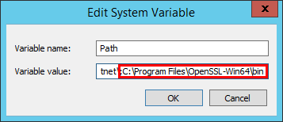

## Setting up local NuGet service

In this tutorial we are going to set up and configure a local NuGet service\
for our development network.\
The service will be available to LAN, with an option to expose it to the public\
network if needed.

## Components

### The host

To get everything up and running, I will use a standalone virtual machine running\
Windows 2012 R2 server with the following dimensions:

|Property          |Value
|:---              |:---
|OS                | Windows Server 2012R2
|Type              | Virtual
|vCPU              | 2 (**more is better**)
|vRAM              | 4 GB (**more is better**)
|Domain Joined     | optional

The server will have 2 virtual drives - drive [**C**] for the operating system, and \
drive [**E**] to house service binaries and user repositories.

### Software
For the purpose of this tutorial, I will use `BaGet` server.\
Here are the details:
|Property          |Value
|:---              |:---
|Software          | BaGet
|Software URL      | https://github.com/loic-sharma/BaGet/
|Software installed| E:\Baget\

## Installation tips and issues
The software works right of the box, just unzip to a folder and run the start command.\
After starting up, the server listens on 127.0.0.1 port 5000, and there are no obvious\
ways to change that without re-compiling. The software author claims that IIS could be\
used as a proxy, but in reality, Windows 2012R2 Server has unexplainable problem with it.\
Might be related to .NET vs .NET Core which BaGet requires. This effectively renders the\
software bound to localhost interface with no easy way to expose it to the rest of the LAN.

## Exposing to the external hosts
### Method 1
To expose the service to the LAN a built-in Windows ***portproxy*** feature may be used.\
This feature allows forwarding traffic between the ports <ins>*on the same machine*</ins>, or\
to an external target. The following command exposes port 80 to the LAN and forwards\
all traffic to 127.0.0.1 port 5000:
```PowerShell
netsh interface portproxy add v4tov4 listenport=80 listenaddress=* connectport=5000 connectaddress=127.0.0.1     
```
To disable (when / if needed) execute command below with elevated privileges:
```PowerShell
netsh interface portproxy delete v4tov4 listenport=80 listenaddress=*
```
This method is good enough to get started, however, some of the consuming applications \
and development tools may have an issue with unsecured `http` connection.

### Method 2
This is what we are going to go with - Local reverse proxy that would listen on ports 80 (http), \
and 443 (https). To get this going, we will install NGINx on the server, and use it to reverse\
proxy our IP traffic from LAN to the local instance of `BaGet` service.

## Installation plan
1. Download and install .NET core
1. Download and Install `BaGet` service binary files
1. Run `BaGet` and test the service sanity
1. Make `BaGet` run as the system service \
This is very important because it allows continuous service presence after system \
reboots, and keep it running when no one is logged in to the Windows Server console.
1. Install and configure NGINx to act as reverse proxy into `BaGet` service

To make `BaGet` and `NGINx` run as system service we will use `NSSM - the Non-Sucking` \
`Service Manager` available free at [https://nssm.cc/](https://nssm.cc/)

## Installation Steps
At this point, you should have a Windows 2012R2 server (physical or virtual) ready to\
become your NuGet server.

### Download and install .NET Core
Download and install 
[.NET Core SDK](https://dotnet.microsoft.com/download/dotnet-core/thank-you/sdk-3.1.302-windows-x64-installer)
from Microsoft. This is very simple process - just \
grab the executable from Microsoft, and run it. If it asks for a reboot after installation \
let it reboot the server.

### Download BaGet server
The BaGet releases are available free at [GitHub BaGet repository](https://github.com/loic-sharma/BaGet/releases/).
At the time of composing \
this article, the latest release was `v0.3.0-preview4`, and that's what we are going to use.

On the [https://github.com/loic-sharma/BaGet/releases/tag/v0.3.0-preview4](https://github.com/loic-sharma/BaGet/releases/tag/v0.3.0-preview4)
page, all the way \
at the bottom, you would find a link to [`BaGet.zip`](https://github.com/loic-sharma/BaGet/releases/download/v0.3.0-preview4/BaGet.zip)
file - that's what we are going to download \
to `E:\Baget` directory on our server, then unzip all the files into that same directory, which \
also means that `E:\Baget` now becomes home for the NuGet service.

### Run BaGet server application
Start the BaGet server, and make sure you can connect to it locally. To do so, open elevated\
command prompt and execute:
```ps
E:
cd \Baget
dotnet BaGet.dll
```
The BaGet server will start and you will see output:
```
E:\baget>dotnet BaGet.dll
info: Microsoft.Hosting.Lifetime[0]
      Now listening on: http://[::]:5000
info: Microsoft.Hosting.Lifetime[0]
      Application started. Press Ctrl+C to shut down.
info: Microsoft.Hosting.Lifetime[0]
      Hosting environment: Production
info: Microsoft.Hosting.Lifetime[0]
      Content root path: E:\baget
```
Note that BaGet now listens on all interfaces and is bound to port 5000. This is good, \
because in the version we just downloaded, the developers made changes to primary \
listener. The `listens only on localhost` statement from the [Installation tips and issues](#Installation-tips-and-issues) \
no longer apply, which is a good thing.

### Validate connectivity
Open a web browser (don't use IE, install [Brave](https://brave.com/), Chrome, or Firefox instead), and navigate \
to [http://127.0.0.1:5000](http://127.0.0.1:5000). If you see a page (sample below), then you have successfully\
started your BaGet server.


After validating that BaGet is running and happy, terminate the process by pressing \
[**CTRL**] [**C**] in the command window where you started the BaGet server.

### Make BaGet run as a system service
Download NSSM from [https://nssm.cc/](https://nssm.cc/), save the file to the Downloads folder on your\
server.\
Open the archive and extract `nssm.exe` file from `win64` directory. If your server runs 32 bit \
edition of windows, then extract `nssm.exe` from `win32` directory. In either case, you are \
going to end up with one file extracted to your downloads folder. \
**NOTE**: Windows Server 2012R2 is available in 64 bit edition only.\
Now open elevated command prompt (run cmd.exe as Administrator), change directory\
To your downloads (or wherever you have extracted `nssm.exe`) and then copy nssm.exe \
file to `c:\windows\system32`.
```ps
cd %userprofile%\downloads
copy nssm.exe c:\windows\system32\
```
At this point we have all the bits and pieces in place, and we are ready to enable BaGet \
as system service.

**IMPORTANT**: be sure that nssm.exe was copied to `c:\windows\system32`, and your BaGet\
directory is `E:\baget`.

Open elevated command prompt, and execute these two commands to create BaGet service
```ps
nssm install BaGet dotnet.exe baget.dll
nssm set baget AppDirectory E:\Baget
```
This will respectively create the system service named BaGet and set the service working \
directory to `E:\baget`. To validate the service was created properly, you can execute:
````ps
nssm edit baget
````
from the command prompt to look at (and change if needed) advanced parameters.

 

You may consider changing the service description to identify it later.\
When done with changes (on any of the tabs), click [**Edit Service**] button to apply.\
*This is a little confusing, but nevertheless, Edit Service button commits the changes*.

Now you should run `services.msc` from the command line, find `BaGet` service, and \
start it. If everything was done correctly, the service status will change to `running`.

### Validate service
To validate the service is up and running, use the same method as you did when\
you [Validated Connectivity](#validate-connectivity).

### Enable https with NGINx
To be fair, NGINx is not a must for enabling https. You may choose to install and \
configure Apache httpd or IIS, or any other reverse proxy service of your choice, \
including built-in Windows ***portproxy*** feature mentioned in [Method 1 Section](#method-1).\
The NGINx was chosen here because I used it for my deployment, and it is proven\
to be lightning fast reverse proxy with very small memory footprint.

#### Download and Install NGINx
NGINx (pronounced 'engine X') is an open source software available for download on\
[NGINx Website](https://nginx.org) free of charge. At the time of composing this article, the current Stable \
release of NGINx for Windows was 1.18 with a download link at:\
[https://nginx.org/download/nginx-1.18.0.zip](https://nginx.org/download/nginx-1.18.0.zip)

Download the file and extract the contents into a folder "nginx" under your Downloads.\
The zip archive contains full directory structure Nginx needs to run. Once extracted, copy \
the entire directory structure to `c:\Program files\nginx` directory. You would need to \
create `c:\Program Files\nginx` directory manually.

At this point, we need to make NGINx run as Windows system service. We will use nssm\
to make it happen.

Open elevated command prompt, end execute the following commands:
```ps
nssm install NGINx "c:\program files\nginx\nginx.exe"
nssm set nginx appdirectory "c:\program files\nginx"
```
This will create and configure NGINx system service. Don't start it yet. We now need\
to edit NGINx configuration and make it act as a reverse proxy to our BaGet service.

First thing we need to do is create a ssl certificate. This certificate has to be trusted\
on the client machines that would access our NuGet server.

There are number of ways to create a self-signed certificate, as well as obtaining a \
real certificate from well-known Certification Authorities, or locally managed CAs.

If you happen to have a real CA certificate issued for your server, rename the PEM \
certificate to `cert.pem`, rename private key to `cert.key` and then copy both files \
to `c:\program files\nginx\conf` directory.

The process of issuing certificate is outside of this tutorial scope, however, to give\
you a kickstart, the procedure below will get you going:

##### Find out your server host name and domain name - open cmd.exe and execute:
```ps
ipconfig /all
```
the output would something like:
```ps
Windows IP Configuration

   Host Name . . . . . . . . . . . . : baget-lab-svr
   Primary Dns Suffix  . . . . . . . : localdomain
   Node Type . . . . . . . . . . . . : Hybrid
   IP Routing Enabled. . . . . . . . : No
   WINS Proxy Enabled. . . . . . . . : No
   DNS Suffix Search List. . . . . . : 
   . . .
   IPv4 Address. . . . . . . . . . . : 192.168.1.50(Preferred)
```
we are interested in 3 lines here: `Host Name`, `Primary DNS Suffix`, and `IPv4 Address`. \
These values would have to be a part of your new certificate.

To issue a new self-signed certificate we will use OpenSSL. Let's get it installed. 

##### Download and install OpenSSL for Windows
OpenSSL for windows requires Visual C++ 2017 runtime. Download and install \
the VC 2017 runtime binaries from: [Microsoft direct link](https://download.visualstudio.microsoft.com/download/pr/4100b84d-1b4d-487d-9f89-1354a7138c8f/5B0CBB977F2F5253B1EBE5C9D30EDBDA35DBD68FB70DE7AF5FAAC6423DB575B5/VC_redist.x64.exe)

Prebuilt OpenSSL for Windows binaries available free at [Shining Light Productions](https://slproweb.com/products/Win32OpenSSL.html)\
website. Download and run 64 bit version installer: [direct link to MSI file](https://slproweb.com/download/Win64OpenSSL_Light-1_1_1g.msi)

During the installation, wizard will prompt where to place OpenSSL library files.\
Since we are not going to perform any SSL development tasks on this server, select\
`Open SSL Binaries (/bin) Directory` as shown below:

\
and let the wizard finish installation.

##### Add OpenSSL direcotry to system path
Now we need to add `C:\Program Files\OpenSSL-Win64\bin` to System Path. This very easy \
to do - from elevated command prompt execute:
```ps
rundll32 sysdm.cpl,EditEnvironmentVariables
```
which will bring up the Environment Variables dialog. What we need to do now is edit the\
Path under System Variables, append ";" and `C:\Program Files\OpenSSL-Win64\bin` to the\
end of it:

 

Now we have all the tools we need to create a self-signed certificate. We would need \
three elements captured from `ipconfig /all` earlier. These elements are `Host Name`,\
`Primary DNS Suffix`, and `IPv4 Address`.

##### Generate self-signed certificate
Replace *shost*, *sdomain*, and *sip* in the **set** commands below with values captured from \
`ipconfig /all` command; use notepad to copy paste and edit the commands, then copy all,\
open elevated command prompt, navigate to `C:\Program Files\nginx\conf` and paste/execute commands:
```ps
set shost="mybaget"
set sdomain="mydomain.lan"
set sip="192.168.1.199"
cd "C:\Program Files\nginx\conf"
set sfqdn="%shost%.%sdomain%"
openssl req -x509 -nodes -days 3650 ^
 -subj "/CN=%sfqdn%" ^
 -addext "subjectAltName = DNS.1:%shost%,DNS.2:%sfqdn%,IP.1:127.0.0.1,IP.2:%sip%" ^
 -addext "extendedKeyUsage = serverAuth" ^
 -newkey rsa:2048 -keyout cert.key -out cert.pem
 
```
That's it - you now have a self-signed certificate ready for the NGINx service.\
We are almost there. The last thing we need to do is to change NGINx config file \
to enable reverse proxy functionality.

##### Update NGINx Configuration
Open Windows Explorer, navigate to `C:\Program Files\nginx\conf` directory.\
You will see a file named `nginx.conf` - that's the file we need to edit. You may want \
to (optionally) back this file up somewhere for future reference.

Open the file in Notepad or Notepad++ (do not use WordPad!), delete all the content, \
and paste the following into it:
```nginx
#user  nobody;
worker_processes  1;

#error_log  logs/error.log;
#error_log  logs/error.log  notice;
#error_log  logs/error.log  info;

#pid        logs/nginx.pid;


events {
    worker_connections  1024;
}


http {
	include       mime.types;
	default_type  application/octet-stream;

	#log_format  main  '$remote_addr - $remote_user [$time_local] "$request" '
	#                  '$status $body_bytes_sent "$http_referer" '
	#                  '"$http_user_agent" "$http_x_forwarded_for"';

	#access_log  logs/access.log  main;

	sendfile        on;
	#tcp_nopush     on;

	#keepalive_timeout  0;
	keepalive_timeout  65;

	#gzip  on;

	server {
		listen 80;
		server_name _;

		client_max_body_size 512M;
		proxy_set_header     X-Forwarded-For $proxy_add_x_forwarded_for;
		proxy_set_header     X-Forwarded-Proto $scheme;
		proxy_set_header     Host $host;

		location / {
			proxy_pass http://127.0.0.1:5000;
		}
	}
	
    server {
        listen       443 ssl;
        server_name  _;

		client_max_body_size 512M;
		proxy_set_header     X-Forwarded-For $proxy_add_x_forwarded_for;
		proxy_set_header     X-Forwarded-Proto $scheme;
		proxy_set_header     X-Forwarded-SSL on;

        ssl_certificate      cert.pem;
        ssl_certificate_key  cert.key;

        ssl_session_cache    shared:SSL:1m;
        ssl_session_timeout  5m;

        ssl_ciphers  HIGH:!aNULL:!MD5;
        ssl_prefer_server_ciphers  on;

		location / {
			proxy_pass http://127.0.0.1:5000;
		}
    }
}
```
save the file and start NGINx service: run `services.msc`, locate NGINx service, click start.

At this point you can try connecting to your NuGet service from a machine on your LAN.

#### Final touch
There is one more thing you would need to do if you issued a self-signed certificate.\
Copy `cert.pem` file we created earlier to the machine where you would run Visual Studio.\
Again, on the machine where you would run Visual Studio, run `certmgr.msc`, navigate to\
`Trusted Root Certification Authorities`, expand it, then right-click `certificates`.\
In the context menu select `All Tasks` and click `Import`. This will display a File Open Dialog.\
Change file type to `All Files (*.*)` then navigate to the directory where you have copied\
`cert.pem` file, select it, and complete the import procedure.

You can now point web browser on that machine to `https://ip-of-nuget-machine` and it\
would show no security warnings.

If your DNS functioning correctly, you can also use full machine name that you captured\
from `ipconfig /all` command on BaGet server instead of the IP address.


